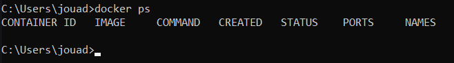
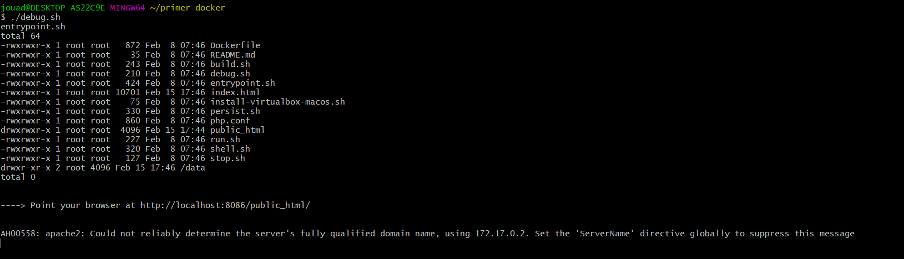
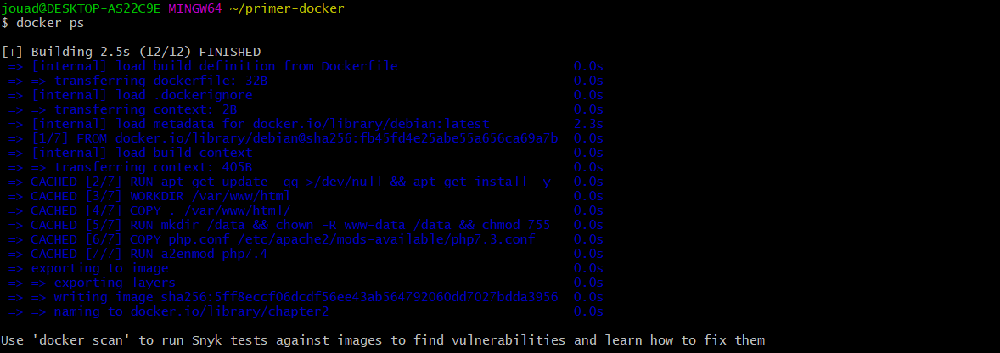
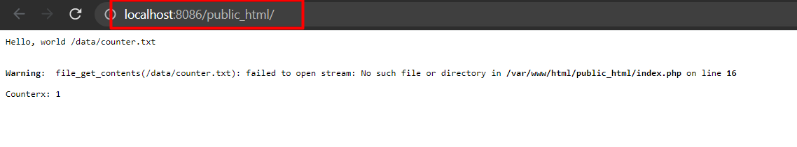
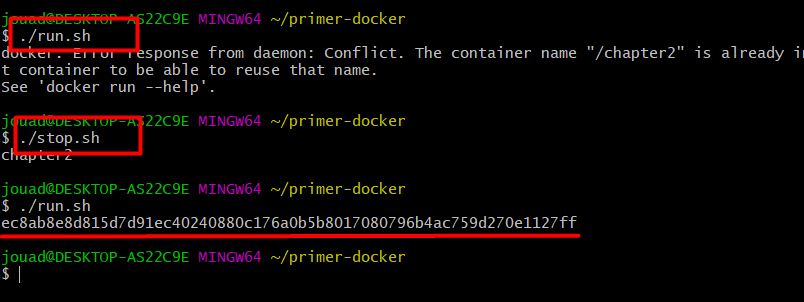
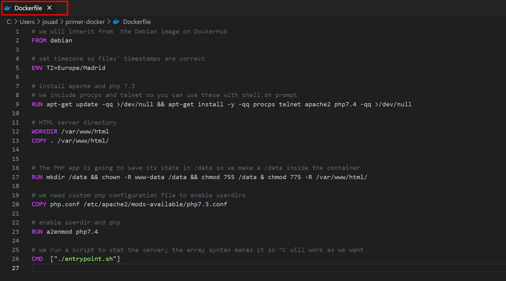
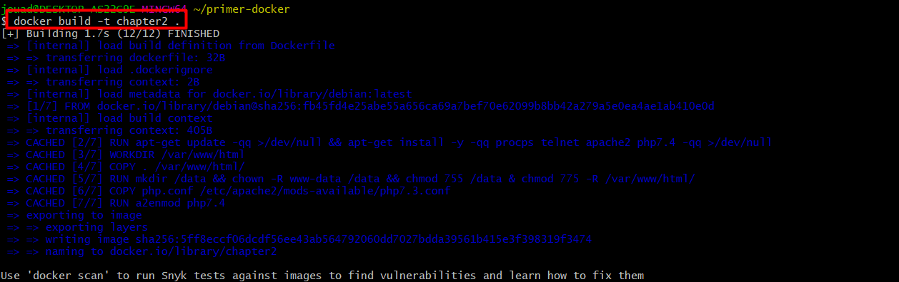

# Practica-PrimerDocker

Esta sería la primera práctica realizada en docker del curso.
Hay que seguir una serie de pasos para llevarla a cabo:

- Creamos un repositorio en github, como este
- Y descargamos el zip con los ficheros necesarios
  - (Que habrá una pequeña aplicación Apache+PHP)

Empezamos comprobando que tenemos docker instalado.

Una vez hecho seguimos los scripts del fichero descargado.
Los scripts sh son los siguientes:

- ./build.sh: Crea el container a partir de la definición descrita en Dockerfile. Se debe lanzar cada vez que este fichero cambie.
- ./debug.sh: Corre el container en primer plano de tal forma que se puede parar con ^C
- ./run.sh: Corre el contenedor como un demonio (daemon). Se usa para probar el contenedor en loca pero como si fuera producción.
- ./stop.sh: Cuando el contenedor corre en background, este es el script para pararlo.
- ./shell.sh: A veces las cosas no funcionan según lo esperado y mediante este script se abre un shell en el contenedor una vez arrancado, de tal forma que podamos hacer diagnósticos.

Comando ./debug.sh:

Comando ./build.sh: 

Visitamos el localhost que nos devuele

Comando ./run.sh, para que funcione tenemos que comprobar que no hay ningún contenedor en marcha.

Por último vamos a comprobar el contenido del fichero **Dockerfile**:

Terminamos ejecutando el contador de chapter2:

NOTA: Esta práctica se ha realizado en un sistema operativo Windows 10.

Bibliografía:
- https://github.com/maximofernandezriera/practica-primer-docker/blob/main/README.md